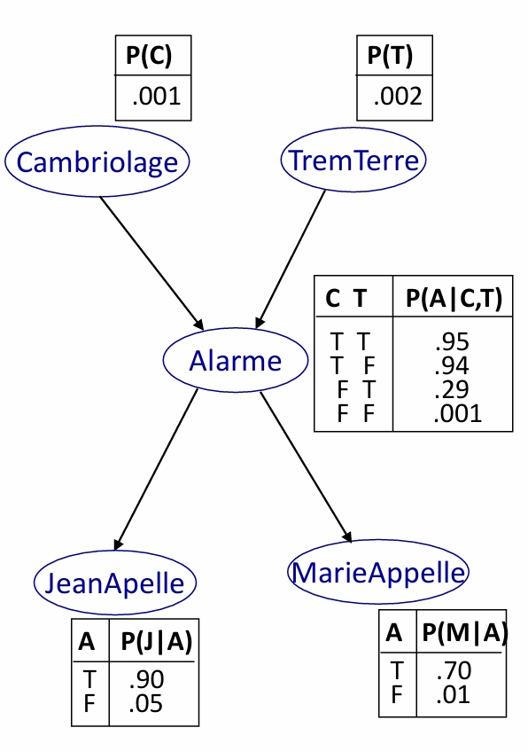

approche sémantique par table de vérité
# Raisonnement automatique
## Khaled Belahcène
### Séance 7 - lundi 9 février 2026

## La pelouse
### I. en logique classique
* si il pleut alors ma pelouse est mouillée
* si mon arroseur s'est déclenché alors ma pelouse est mouillée

1. *Lundi*, il pleut. Que puis-je en déduire ? Formaliser.

2. *Mardi*, la pelouse est mouillée. Que puis-je en abduire ? Ai-je raison ?

> * **déduction** : produire les conclusions connaissant les prémisses et les règles
> * **abduction** : produire les prémisses connaissant les conclusions et les règles
> * La déduction est correcte. Et l'abduction ?

3. **Planification conformante en environnement incertain** :  Mercredi, je veux que la pelouse soit mouillée. Comment faire ?

4. Nouvelle règle : si il pleut, alors la pelouse de mon voisin est mouillée
* (question assez ouverte : comment le modéliser élégamment en logique ?)
* *Jeudi*, ma pelouse et celle de mon voisin sont mouillées. Que puis-je abduire ?
* *Vendredi*, ma pelouse est mouillée et celle de mon voisin n'est pas mouillée. Que puis-je abduire ?
* *Samedi*, ma pelouse n'est pas mouillée mais celle du voisin est mouillée. Que puis-je abduire ?

### II. Logique des pénalités

On associe une pénalité à chaque règle

* $r_1$ : pluie $\to$ ma_pelouse_mouillée, 13
* $r_2$ : pluie $\to$ pelouse_voisin_mouillée, 15
* $r_3$ : mon_arrosage $\to$ ma_pelouse_mouillée, 8
* $r_4$ : pelouse_voisin_mouillée $\to$ pluie, 6

1. Evaluer le karma de chaque interprétation du monde en sommant les pénalités des règles qu'elles violent. Construire le tableau suivant :

| p | a | m | v | $r_1$|$r_2$ | $r_3$|$r_4$ |	karma pondéré
|---|---|---|---|---|---|---|---|   --- |
| 0 | 0 | 0 | 0	| V | V | V	| V | $0$ |
| 0 | 0 | 0 | 1	| V | V | V	| F | $-6$ |
| ... |  |  | 	|  |  | 	|  |  |

2. Reprendre les questions du vendredi et du samedi. Comment interpréter la table du karma ?

3. Comment automatiser ce raisonnement ?

#### Essayons de donner un sens à cette cuisine numérique :)
3. **Règles anonymes**. On suppose que toutes les règles sont pondérées de la même manière (wlog, on prend cette pénalité égale à 1). Ajouter une colonne pour calculer ce nouveau *karma anonyme*.
Comment qualifier les lignes de la table du karma de plus petite valeur ?

3. **Règles indépendantes**. les événements $r_i$ est respectée et $r_j$ est respectée sont indépendants pour $i\ne j$, de probabilités respectives $p_i$ et $p_j$. 
* a) Quel nom donne-t-on parfois à cette hypothèse ?
* b) On peut calculer la probabilité qu'une certaine conjonction de règles soit observées. Quelle relation entretiennent les pénalités et les nombres $p_i$ ?

4. **Bornes de Fréschet**. soient $A$ et $B$ deux événements de probabilités respectives $p(A)$ et $p(B)$.
* a) Quel encadrement peut-on donner pour $p(A \cup B)$ et $p(A \cap B)$ ?
* b) En déduire d'autres façons de calculer le karma de chaque interprétation.
* c) Comment mettre en oeuvre ce raisonnement de manière automatique ?

### III. Raisonnement bayésien

**Détection de cambriolage**

Je suis souvent à l’extérieur de chez moi et je m’inquiète d’un cambriolage durant mon absence.
* J’ai fait installer un système d’alarme chez moi.
* Mes voisins, Marie et Jean, m’ont promis de m’appeler
à chaque fois qu’ils entendent mon système d’alarme.
   * Jean confond parfois l’alarme avec le téléphone.
   * Marie n’entend pas toujours l’alarme, car elle met la
musique trop forte chez elle.
* Parfois mon système d’alarme déclenche lors de légers
tremblements de terre.

Comment conclure qu’il y a un cambriolage chez moi ?

 .

1. **Loi jointe**:
* calculer $P(j,m,a,\neg c, \neg t)$
* construire la table entière de la loi jointe
2. **Requêtes**
* a)  **Marginalisation** : Quelle est la probabilité que l'alarme se déclenche ? que Jean appelle ?
* b) **Pronostic** : il y a un cambriolage. Quelle est la probabilité que Jean appelle ?
* c) **Diagnostic** : Jean et Marie appellent. Quelle est la probabilité d'un cambriolage

3. Aurait-on pu construire un autre réseau ? Justifier en le faisant, ou en prouvant le contraire.

> **Indépendance** $A$ et $B$ sont indépendantes ssi
>*  ssi $P(A|B) = P(A)$ 
>* ssi $P(B|A)=P(B)$ 
>* ssi $P(A \cap B) = P(A)\times P(B)$

> **Indépendance conditionnelle**. $A$ et $B$ sont indépendantes sachant $C$
> *  ssi $P(A|B,C)=P(A|C)$ 
> * ssi $P(B|A,C)=P(B|C)$
> * ssi $P(A \cap B|C)=P(A|C) \times P(B|C)$.

3. Montrer que  :
* a) C et M sont dépendants
* b) C et M sont indépendants étant donné A
* c) J et M sont dépendants
* d) J et M sont indépendants étant donné A
* e) C et T sont indépendants
* f) C et T sont dépendants étant donné A

### Pour aller plus loin :
* théorie de Dempster-Shafer
* théorie des copules
* fonctions de croyance
* théorie des possibilités
* probabilités imprécises
* dynamique des croyances

